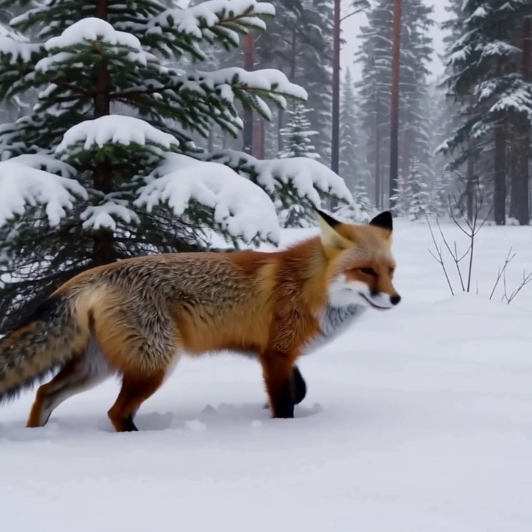
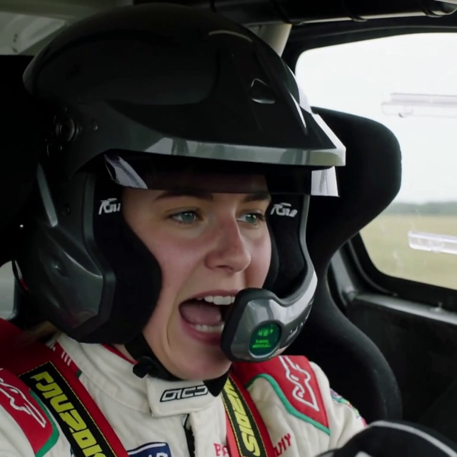

# minimax-h3-swift-mlx

> ⚠️ **Work in progress** — text-to-video (`t2va`) and keyframe-conditioned video (`fl2va`) both
> work end-to-end and are numerically validated against the reference implementation, but APIs,
> CLI flags and performance are still moving.

Swift MLX port of [MiniMax-H3](https://huggingface.co/MiniMaxAI/MiniMax-H3) for Apple Silicon:
**joint video + synchronized stereo audio generation** — one 33B guidance-distilled transformer
denoises a single packed sequence holding text, audio and video rows at once. 24 fps, 5–15 s,
768 px short edge, 32 kHz stereo, no CFG, no vocoder. Generate from a prompt, or from a prompt
plus a first (and/or last) keyframe image.

## Examples

| 🦊✨ [Fox showcase — full specs](docs/examples/t2va/fox-showcase-768x768.mp4) | 🏎️ [Rally co-pilot — one French sentence + `--enhance-prompt`](docs/examples/t2va/rally-copilot-768x768.mp4) |
|---|---|
|  |  |

More (including the first 960×544 fox) in [docs/examples/t2va](docs/examples/t2va/README.md).

**Keyframe-conditioned** — a real photograph of a *parked* car, a prompt telling it to hover then
launch, and a detonation asked to land on the departure. It obeys on both counts: the car leaves
the ground and stays a 2CV for 14.4 s, and the blast peaks at −1.6 dB inside the second its
timecode named (versus −44 dB during the hover).

| 🚗🔥 [The 2CV launch — 14.4 s, sound event on its timecode](docs/examples/fl2va/2cv-launch-576x384-14s.mp4) |
|---|
|  |

Input image, exact prompts, settings, audio envelope and an honest look at where the shorter
first attempt breaks down: [docs/examples/fl2va](docs/examples/fl2va/README.md).


## Status (August 2026)

**Working:**
- Full t2va pipeline: tokenizer → Qwen3-VL-32B conditioner (layers 0–49 only) → 33B
  Omni-Transformer → ViT video VAE (tiled + temporally chunked, fp16) → BigVGAN audio VAE →
  MP4 mux (H.264 + AAC) via AVFoundation
- **fl2va — keyframe-conditioned generation** (`--image`, `--last-image`): Qwen3-VL vision tower
  + interleaved 3-axis mrope + deepstack injection for the `<Picture i>` presentation, causal
  CNN video VAE encoder for the conditioning rows, PIL-exact canvas preparation. The keyframe
  anchors the loop (noise-augmented at t = 0.999, never updated) while the prompt still drives
  the action — see [the flying 2CV](docs/examples/fl2va/README.md)
- Strict sequential loading fits full-precision bf16 in 96 GB unified memory
- **Numeric parity vs the diffusers reference** (`minimax-h3 parity`, dumps via
  `scripts/parity_reference.py`): audio VAE max|Δ| 5e-6, video VAE 1.3e-5 (fp32) / 1.1e-2 (fp16
  autocast recipe), packing grid exact (Δ=0), DiT block-0 video & audio velocities at bf16 noise,
  keyframe canvas preparation bit-exact, and the **whole fl2va conditioner at full depth**
  (`hidden_states[50]`: relative RMS 0.024, cosine 0.9997)
- Built-in profiling (`--profile`, [swift-mlx-profiler](https://github.com/VincentGourbin/swift-mlx-profiler)):
  console report + Perfetto trace
- Crash-safe generation: raw frames+audio saved as `.raw.safetensors` before muxing;
  `minimax-h3 mux` rebuilds an MP4 anytime (`--normalize-audio` for quiet scenes)
- **Local Context-IR, multimodal** (`minimax-h3 enhance`, `generate --enhance-prompt`): Gemma 4
  E4B rewrites free-form prompts into the structured format H3 was trained on (~5-20 s, via
  [gemma-4-swift-mlx](https://github.com/VincentGourbin/gemma-4-swift-mlx)) — the local
  substitute for MiniMax's hosted H3-Context-IR stage. Reference media drive the official
  cookbook formats: `--image` (I2VA), `--image + --last-image` (FL2VA), `--last-image` (L2VA),
  `--audio` (soundscape/music mirrored, speech transcribed verbatim into `<d>`), `--video`
  (shots/camera/pacing as structural inspiration)

**Timings (M3 Max, bf16, full precision):**
- ~23 s/step at 960×544×22 frames (~3.7k packed tokens); ~4.5 min/step at 960×544×124 frames
  (~17.4k tokens — attention is ~75 % of a step at that length)
- Weight loads: ~2 min 20 total from external USB SSD (profiled; quantization will cut this)

**Quantization** (`--transformer-quant` / `--text-encoder-quant`, qint8/qint6/int4, MiniMax's
official module exclusions; `export-quantized` writes reusable prequantized checkpoints that
loaders pick up automatically):
All MLX modes are wired (affine qint8/qint6/int4, microscaling mxfp8/mxfp4, nvfp4). Idle
benchmarks, same seed, 3.7k-token steps — per-forward fidelity is max|Δ| of the DiT block-0
velocity vs the reference (bf16 noise floor: 1.11 on a 260 scale):

| Mode | Fidelity | Step | Transformer resident | Load |
|---|---|---|---|---|
| bf16 | 1.11 | 31.2 s | 61.7 GB | 1 m 15 |
| **qint8** | **1.41** | **28.0 s** | **18.5 GB (+16 AdaLN scales)** | **39.7 s prequantized** |
| mxfp8 | 5.16 | 24.5 s | ~33 GB peak | on-the-fly |
| int4 | 5.32 | 23.6 s | ~19 GB peak | on-the-fly |
| mxfp4 | 7.22 | — | — | — |

Affine beats microscaling on fidelity for this checkpoint; every mode still yields clean samples
(same-seed PSNR vs bf16 — qint8 33 dB, int4/mxfp8 ~20 dB — measures diffusion-trajectory
divergence, not visual quality). **Recommended default: prequantized qint8 for both components**
— near-transparent fidelity, bf16-or-better step speed, −45 % peak memory, ~2× faster loads.
Full methodology and numbers: [docs/knowledge/benchmarks/quantization-2026-08.md](docs/knowledge/benchmarks/quantization-2026-08.md);
the prequantized export/load round-trip is validated bit-exact for every mode family.

**Not yet:**
- ref2va, and the hosted-only H3-Context-IR / H3-Regenerate-2K stages
- MiniMax's sparse attention for H3 (still unpublished — their [MSA](https://github.com/MiniMax-AI/MSA)
  release is SM100 CUDA kernels, so only the algorithm transfers here) — the real unlock for
  full 768p speed
- `--last-image` alone (L2VA) and first+last together share the fl2va code path but have not
  been run end to end yet

## Requirements

- Apple Silicon Mac, **96 GB+ unified memory** for full-precision bf16 (quantized paths later)
- macOS 15+, Xcode 16+
- ~145 GB of weights (diffusers layout)

## Getting the weights

```bash
export H3_MODELS_DIR=/path/to/models/MiniMax-H3   # or pass --models-dir to every command
hf download MiniMaxAI/MiniMax-H3 \
  --include "model_index.json" --include "scheduler/*" --include "audio_scheduler/*" \
  --include "tokenizer/*" --include "processor/*" --include "text_encoder/*" \
  --include "transformer/*" --include "vae/*" --include "audio_vae/*" \
  --local-dir "$H3_MODELS_DIR"
```

## Build

Build with `xcodebuild` (SPM binaries can't locate MLX's metallib):

```bash
xcodebuild -scheme minimax-h3 -configuration Release \
  -destination 'platform=macOS,arch=arm64' -derivedDataPath .xcodebuild build
alias minimax-h3=$PWD/.xcodebuild/Build/Products/Release/minimax-h3
```

## Tests

```bash
# No checkpoint needed — geometry, interleaved-mrope layout, presentation tagging,
# canvas preparation, block-major patchify, packed sequence. ~0.4 s.
xcodebuild test -scheme minimax-h3 -destination 'platform=macOS' -derivedDataPath .xcodebuild

# With the weights: also loads the audio VAE, the video VAE encoder and the vision tower.
# `xcodebuild test` does not forward the environment, so run the bundle directly.
xcodebuild build-for-testing -scheme minimax-h3 -destination 'platform=macOS' -derivedDataPath .xcodebuild
H3_MODELS_DIR=... xcrun xctest .xcodebuild/Build/Products/Debug/MiniMaxH3Tests.xctest
```

## Usage

```bash
# Sanity: load every component against the real checkpoint + tiny forwards
minimax-h3 smoke all

# Text -> video+audio (768p 16:9 canvas, 124 frames ≈ 5.2 s, 50 sigma points)
minimax-h3 generate "A red fox trotting through a snowy pine forest, snow crunching underfoot" \
  -o fox.mp4 --normalize-audio

# Image -> video+audio: the canvas takes the keyframe's aspect ratio, the prompt says what happens
minimax-h3 generate "The car lifts off and flies above the trees" --image car.jpg -o fly.mp4
# ...and/or an ending keyframe (alone: generate *up to* it; with --image: interpolate between)
minimax-h3 generate "..." --image first.jpg --last-image last.jpg -o morph.mp4

# Smaller canvas = much faster per step (multiples of 32). Short edge 768 is the trained
# regime; smaller trades quality (and ~6 dB of audio level) for speed.
minimax-h3 generate "..." -W 960 -H 544 -s 30 -o fast.mp4 --profile

# One-time: export a prequantized text encoder, then every run loads it in seconds
minimax-h3 export-quantized text-encoder --quant qint8
minimax-h3 generate "..." --text-encoder-quant qint8 -o out.mp4

# Rewrite a free-form prompt into H3's Context-IR format (local Gemma 4), or do it inline
minimax-h3 enhance "un renard trotte dans la neige" -f 124
minimax-h3 enhance "il repart entre les sapins" --image frame.png          # I2VA, image-anchored
minimax-h3 enhance "même ambiance sonore" --audio clip.wav                 # soundscape transfer
minimax-h3 enhance "même scène au coucher du soleil" --video ref.mp4       # structural reference
minimax-h3 generate "un renard trotte dans la neige" --enhance-prompt -o fox.mp4

# Rebuild an MP4 from a saved raw result (written automatically before every mux)
minimax-h3 mux fox.raw.safetensors -o fox2.mp4 --normalize-audio
```

**Prompting**: H3 is trained on structured Context-IR prompts (`integrated_multimodal_description:`
/ `overall_soundscape:` / `non_diegetic_music:` sections, `[Shot N]` timecodes). Audio loudness is
scene-faithful — quiet scenes decode quiet. See
[docs/knowledge/playbooks/context-ir-prompting.md](docs/knowledge/playbooks/context-ir-prompting.md)
and MiniMax's prompt guides (`docs/` in the HF repo).

## Architecture

| Component | What | Size (fp) |
|---|---|---|
| Conditioner | Qwen3-VL-32B, **unnormalized hidden state after layer 50** (layers 51+ never loaded) | ~52 GB bf16 |
| Vision tower | Qwen3-VL ViT (27 blocks, deepstack 8/16/24) for `fl2va` keyframes — **bf16, matching the release** | ~0.8 GB bf16 |
| Omni-Transformer | 33B dense single-stream DiT, per-(timestep, modality) AdaLN, 3-axis MM-RoPE | 61.7 GB bf16 |
| Video VAE | f16×t4×d24; causal CNN encoder (keyframes) + 36-layer ViT decoder, tiled+chunked | 10.4 GB (fp16 decode) |
| Audio VAE | DAC encoder (not yet ported) / BigVGAN decoder, mono ×2 for stereo, 40 latents/s | 0.6 GB fp32 |

The packed sequence `[text | keyframe cond | audio | video]` shares one rotary clock between
audio (1 unit/latent @40 Hz) and video (5/3 units/frame @24 fps) — that clock *is* the AV sync.
`INSTRUCTIONS.md` holds the full porting spec and fidelity notes; `docs/knowledge/` collects
measured pitfalls and playbooks.

## Sibling projects

[flux-2-swift-mlx](https://github.com/VincentGourbin/flux-2-swift-mlx) ·
[ltx-video-swift-mlx](https://github.com/VincentGourbin/ltx-video-swift-mlx) ·
[swift-mlx-profiler](https://github.com/VincentGourbin/swift-mlx-profiler)

## License

Code: MIT. Model weights are covered by the
[MiniMax-H3 Community License](https://huggingface.co/MiniMaxAI/MiniMax-H3/blob/main/LICENSE).
