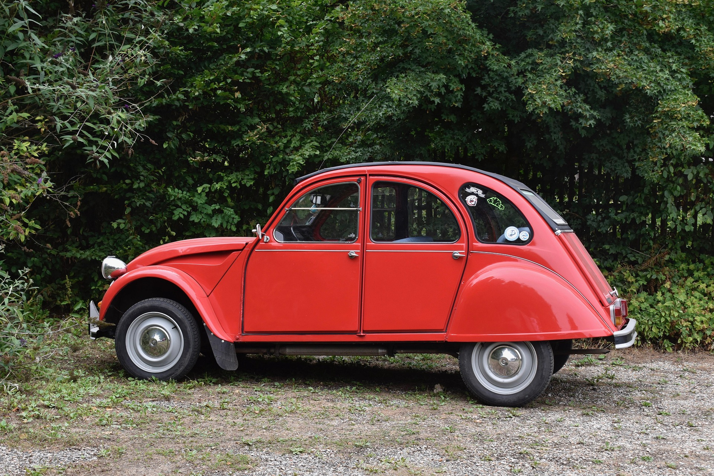
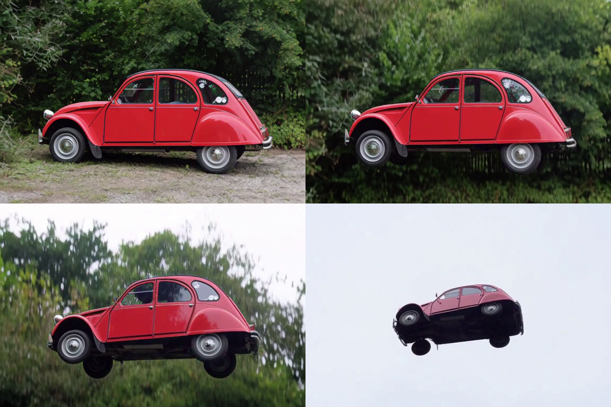
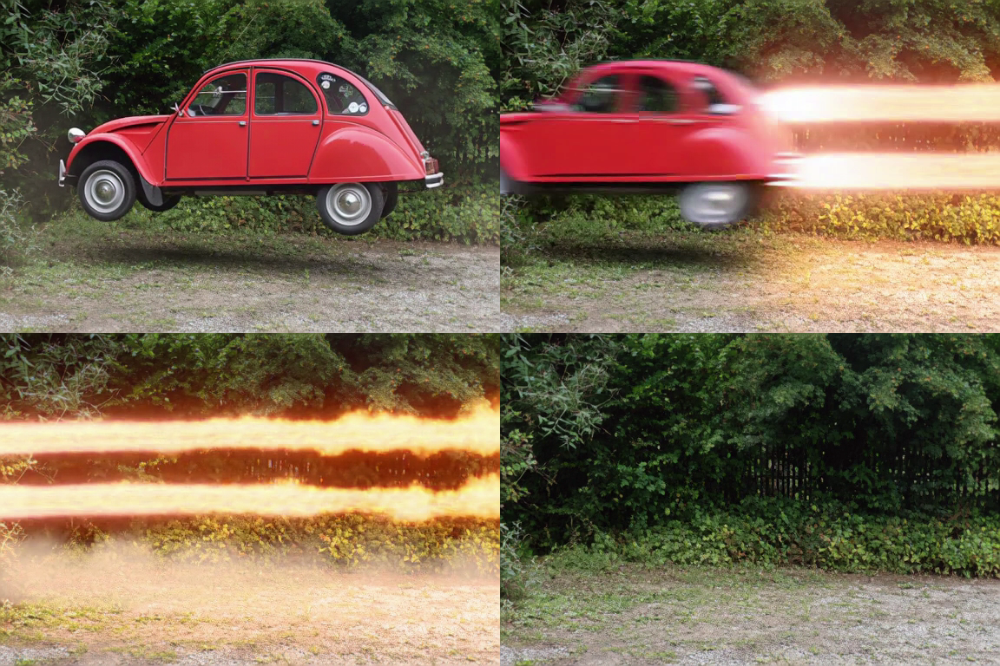
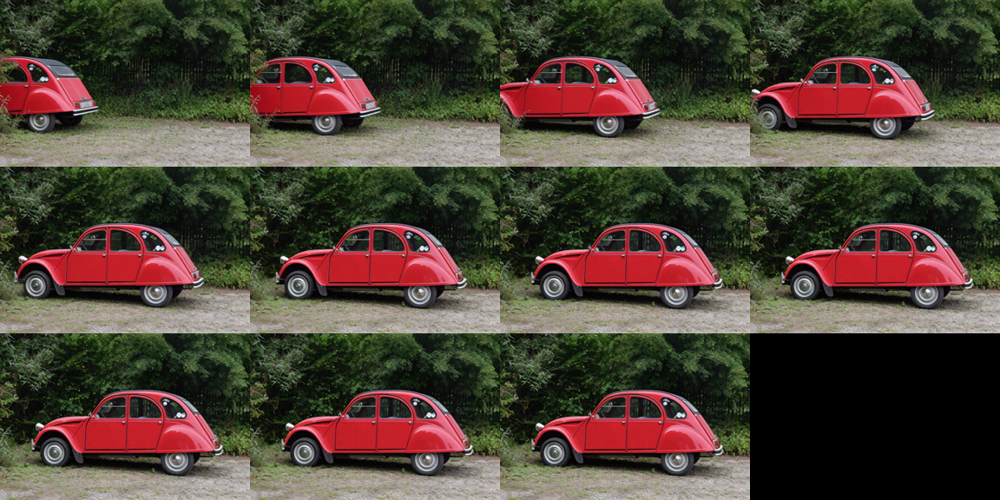
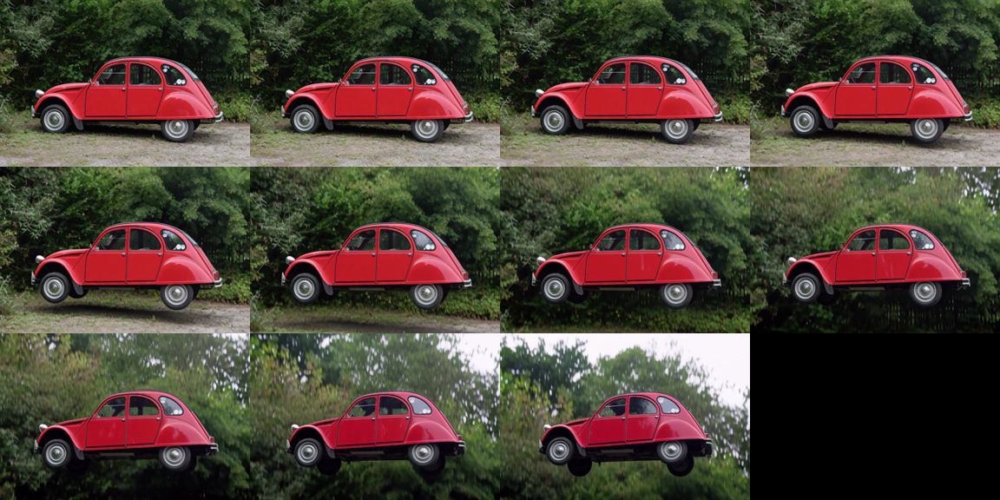
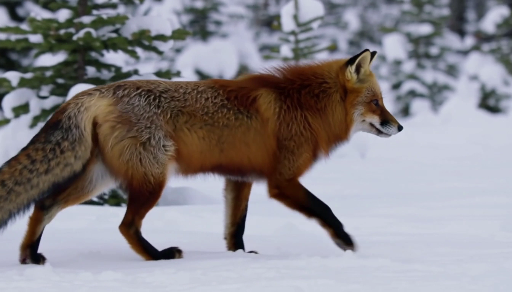

# fl2va — keyframe-conditioned generation

You pin the video to one or two images you provide. Each keyframe goes through the Qwen3-VL vision
tower (as a `<Picture i>` reference in the prompt) *and* through the video VAE encoder (as
conditioning rows that anchor the denoising loop, noise-augmented at t = 0.999 and never updated),
and the prompt says what happens around them. Three modes, all shown below:

| flag | mode | the image is | canvas |
|---|---|---|---|
| `--image` | I2VA | the **first** frame | stretched from that image |
| `--last-image` | L2VA | the **last** frame — the video *arrives* at it | stretched from that image |
| both | FL2VA | both ends pinned | first image's aspect; the second is cover-cropped onto it |

---

## The flying 2CV — does the prompt still win over the image?

The interesting question about keyframe conditioning is not whether the first frame matches. It
is whether the model still *obeys the prompt* when the prompt contradicts the image. So: a real
photograph the model had never produced, of a car that is unambiguously **parked** — and an
instruction to make it **fly**.

### Input



A 1920×1280 photograph (borrowed from [ltx-video-swift-mlx](https://github.com/VincentGourbin/ltx-video-swift-mlx)'s
image-to-video example). Nothing in it suggests motion: the car sits on gravel, wheels straight,
against a hedge.

### Prompt

Written in one French sentence, then rewritten into H3's Context-IR format by the local Gemma 4
stage — the image analysis is what lets it say "the medium side profile shot from the reference
image holds":

```bash
minimax-h3 enhance "La 2CV rouge décolle lentement du sol, s'élève au-dessus des arbres et \
  s'envole dans le ciel, les roues tournant dans le vide." --image 2cv-input.jpg -f 124
```

```
For the target video, at 0.00 seconds into the target video, <Picture 1> (from [Shot 1]) is fully referenced.

integrated_multimodal_description: [Shot 1] Cinematic, medium side profile shot, the vibrant red 2CV
lifts slowly off the ground, rises above the trees, and flies into the sky, the wheels spinning in
mid-air. The camera tracks the vehicle's ascent.

overall_soundscape: The sound of the tires spinning on the gravel fades as the vehicle gains
altitude, replaced by the rush of wind as it flies.

non_diegetic_music: A sweeping orchestral score begins as the car lifts, building tension with
strings and brass as it ascends into the frame.
```

```bash
minimax-h3 generate "$(cat 2cv-fly.prompt.txt)" --image 2cv-input.jpg \
  -W 576 -H 384 -f 124 -s 25 --seed 0 \
  --transformer-quant qint8 --text-encoder-quant qint8 -o 2cv-fly.mp4
```

### Result

▶ [2cv-fly-576x384.mp4](2cv-fly-576x384.mp4) — 576×384, 124 frames (5.2 s), 24 sigma steps,
qint8 throughout, 1 h 01 on an M3 Max.



Reading the four frames (0, 30, 60, 123): the photograph is reproduced — stickers on the rear
quarter window, chrome hubcaps, gravel — then the car leaves the ground, then it is above the
treeline with the background blurred by motion, then it is in open sky.

**What this demonstrates**: conditioning anchors the scene without freezing it. A weaker
conditioning would have lost the 2CV's identity somewhere along the climb; a stronger one would
have kept the car parked.

**Where it fails, honestly**: in the last second, against a featureless white sky, the body loses
coherence — proportions drift and spurious wheels appear. The model has no scene left to hold on
to. More sigma steps and a larger canvas are the obvious levers; this run used 24 steps at
576×384 to keep it under the hour.

The soundtrack follows the action too: peak −4.7 dBFS here versus −27 dBFS for the snowy fox
scene below. H3 mixes faithfully to what the prompt describes — quiet scenes decode quiet.

---

## The launch — a sound event landing on its timecode

The flight above already showed that the prompt wins over the image. This one asks a harder
question: can a *choreography* be placed on a clock — a long hover, a violent departure, and a
detonation that has to land on the departure and not a second later? And can identity survive
14.4 seconds, three times longer than anything else here?

### Prompt

Same keyframe. Written as one French sentence, rewritten by the local Gemma 4 stage, then
corrected by hand on two points that would have sabotaged the test:

- Gemma read the car as a *Volkswagen Beetle*. Left alone, the prompt would have described a
  Beetle while the conditioning rows carried a 2CV — the two halves of the request pulling
  apart. Corrected to "vintage Citroën 2CV".
- It emitted no timecodes. Timecodes are what tie an audio event to an instant in H3's
  Context-IR, so the whole point of the test was missing. Added by hand.

The result is [`2cv-launch.prompt.txt`](2cv-launch.prompt.txt): lift-off at 00:01.000, stationary
hover from 00:02.500 to 00:07.000, launch at **00:07.500** with the twin fire trails, then six
seconds on the empty gravel while they burn out — and, in the soundscape section, the missile
detonation anchored to that same 00:07.500.

```bash
minimax-h3 generate "$(cat 2cv-launch.prompt.txt)" --image 2cv-input.jpg \
  -W 576 -H 384 -f 345 -s 30 --seed 0 \
  --transformer-quant qint8 --text-encoder-quant qint8 -o 2cv-launch.mp4
```

### Result

▶ [2cv-launch-576x384-14s.mp4](2cv-launch-576x384-14s.mp4) — 576×384, **345 frames (14.375 s,
the longest H3 accepts)**, 29 sigma steps, 24 005 packed rows, 3 h 15 on an M3 Max.



At 5 s the 2CV hovers, still unmistakably itself — same stickers on the rear quarter window, same
chrome hubcaps as the photograph, eleven seconds of generation later. At 7.5 s it tears away,
motion-blurred, flame already jetting. At 8.3 s only the horizontal fire trails remain. At 13.7 s
the gravel is empty and the hedge intact.

**The audio lands where it was asked to.** Peak level per second:

| 0 s | 4 s | **7 s** | 8 s | 9 s | 12 s |
|---|---|---|---|---|---|
| −31 dB | −44 dB | **−1.6 dB** | −5.2 dB | −9.5 dB | −24.7 dB |

A 43 dB jump from the hover to the detonation, inside the very second the timecode named. The
rotary clock shared between the audio and video rows — the thing that makes this port's packing
non-negotiable — is doing exactly its job.

This also answers the two questions the shorter clips left open: coherence holds over 14 seconds,
and the scene ends cleanly instead of dissolving, unlike the first 2CV flight above.

---

## Arriving on a photograph — `--last-image` alone (L2VA)

The two clips above start from the photograph. This one has to *end* on it: the model is given
**only the destination** and must invent the five seconds that lead there. Same 2CV photo, used as
the last frame instead of the first.

```bash
minimax-h3 generate "$(cat 2cv-park-l2va.prompt.txt)" --last-image 2cv-input.jpg \
  -W 576 -H 384 -f 124 -s 20 --seed 0 \
  --transformer-quant qint8 --text-encoder-quant qint8 -o 2cv-park-l2va.mp4
```

The prompt's first line is what makes it an L2VA request — the alignment line points the picture at
the *end* of the clip rather than at 0.00 s:

```
How the reference pictures align with the target video — <Picture 1> (from [Shot 1]) aligns with the 5.17-second mark of the target video.
```

### Result

▶ [2cv-park-l2va-576x384.mp4](2cv-park-l2va-576x384.mp4) — 576×384, 124 frames (5.2 s), 19 sigma
steps, qint8, 40 min on an M3 Max.



The car rolls in from the left, decelerates, and settles into exactly the photograph — stickers on
the rear quarter window, antenna, chrome bumper, the same hedge and gravel.

**How close is "exactly"?** Against the keyframe, the first frame scores 12.7 dB PSNR and the last
21.8 dB. The convergence is the point: the trajectory is invented, the destination is not.

**An honest oddity**: the car drives in *backwards*, nose to the left, because the keyframe fixes
its final orientation and the prompt asked it to arrive from the left. Faced with a contradiction,
the model kept the keyframe and gave up the physics.

---

## Both ends pinned — `--image` + `--last-image` (FL2VA)

The hardest of the three: start on one image, land on another, and make the path between them
plausible. First frame is the parked photograph; last frame is a frame taken from the flying-2CV
clip at the top of this page.

```bash
minimax-h3 generate "$(cat 2cv-liftoff-fl2va.prompt.txt)" \
  --image 2cv-input.jpg --last-image 2cv-fly-frame.png \
  -W 576 -H 384 -f 124 -s 20 --seed 0 \
  --transformer-quant qint8 --text-encoder-quant qint8 -o 2cv-liftoff-fl2va.mp4
```

### Result

▶ [2cv-liftoff-fl2va-576x384.mp4](2cv-liftoff-fl2va-576x384.mp4) — 576×384, 124 frames (5.2 s),
19 sigma steps, qint8, 43 min on an M3 Max.



The car lifts off the gravel, the camera tilts up with it, and the background transitions in the
right order — hedge and iron fence, then treetops, then open white sky — arriving on the second
keyframe.

**Both ends verified against each other**, which is what makes the numbers mean something:

| comparison | PSNR |
|---|---|
| first frame vs keyframe 1 (parked) | **21.8 dB** |
| last frame vs keyframe 2 (airborne) | **19.7 dB** |
| cross-check — first frame vs keyframe 2 | **6.3 dB** |

Without the cross-check, 21.8 dB could just mean "two pictures of a red 2CV look alike". At 6.3 dB
the cross-check says otherwise. And 21.8 dB is the same score the L2VA clip gets on its *last*
frame — anchor fidelity does not depend on which end the anchor sits at.

The soundscape follows the climb, −20 dB at the start to −9.6 dB by the fourth second, and sits
30 dB above the quiet L2VA scene — the prompt's soundscape section drives the mix, as it does
everywhere else here.

---

## Fox — quality run at the full canvas



▶ [fox-i2va-1344x768.mp4](fox-i2va-1344x768.mp4) — 1344×768 (H3's maximum canvas), 124 frames,
29 sigma steps, qint8, 8 h 50 on an M3 Max.

Keyframe: [`../t2va/fox-frame.png`](../t2va/fox-frame.png), itself a frame from an earlier t2va
run — which makes it an *easy* keyframe, already inside the model's own distribution. That is
exactly why the 2CV test above matters more.

Note: this run predates the switch of the vision tower to bf16 (see the `conditioner-fl2va`
parity probe), so re-running it today would give a slightly different — and more
release-faithful — result.
