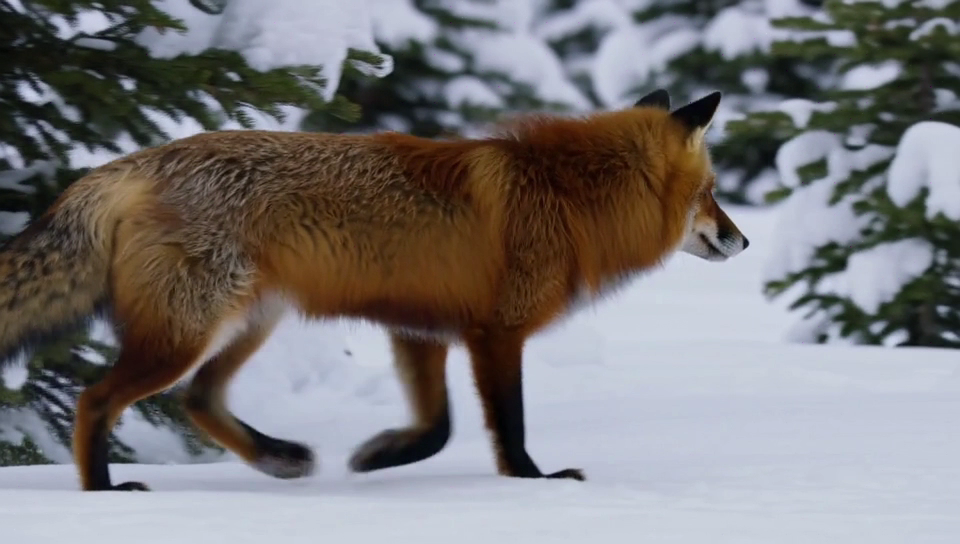
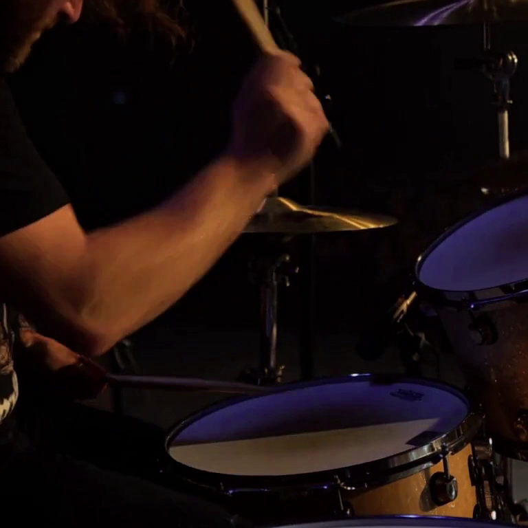

# t2va examples

Generated end-to-end on an Apple M3 Max (96 GB), full-precision bf16, strict sequential
component loading. Audio and video come out of one joint denoising pass — no vocoder,
no post-hoc audio.

## 🦊 Fox in snow — [fox-snow-960x544.mp4](fox-snow-960x544.mp4)

- **Prompt**: `A red fox trotting through a snowy pine forest, snow crunching underfoot`
- 960×544, 124 frames (5.2 s @ 24 fps), 30 sigma points (29 evals), seed 42
- ~2 h 10 denoising + ~25 min loads/decodes on M3 Max
- Audio: soft snow-crunch footsteps + winter ambience, peak-normalized to −3 dBFS at mux
  (H3 mixes at scene-faithful loudness: a quiet scene decodes quiet — see
  `docs/knowledge/playbooks/context-ir-prompting.md`)

## 🦊✨ Fox showcase (full specs) — [fox-showcase-768x768.mp4](fox-showcase-768x768.mp4)

- **Prompt**: full Context-IR format with two shots — the fox trots, pauses at `[Shot 2] At
  00:03.500` (ears pricking toward camera, visible breath), then resumes; `overall_soundscape:`
  scores the footstep crunches stopping during the pause
- 768×768 (trained short-edge regime), 124 frames (5.2 s), 50 sigma points, seed 42,
  prequantized qint8 text encoder + bf16 transformer, `--normalize-audio`
- ~4 h 20 denoising (~5.4 min/step at ~22k packed tokens) on M3 Max
- The shot-2 direction lands: the pause, the ear turn and the interrupted footsteps are all in
  the clip

## 🥁 Drum solo — [drum-solo-768x768.mp4](drum-solo-768x768.mp4)

- **Prompt** (Context-IR style, abbreviated): aggressive rock drum solo, close-miked kit,
  `overall_soundscape:` "deafening… pounding kick, cracking snare, loud crashing cymbals…"
- 768×768, 39 frames (1.6 s), 30 sigma points, seed 7
- Raw model mix peaks at 0 dBFS — loud scene, loud audio, no normalization needed

## 🏎️ Rally co-pilot — [rally-copilot-768x768.mp4](rally-copilot-768x768.mp4)

- **The `--enhance-prompt` end-to-end showcase**: the user input was ONE French sentence —
  *« une copilote de rallye dans l'habitacle annonce à voix haute 'virage serré à droite, puis
  fond à gauche' pendant que la voiture glisse sur le gravier, musique électro tendue »* —
  locally rewritten by Gemma 4 into the structured Context-IR prompt
  ([saved here](rally-copilot.prompt.txt)), then generated by H3
- French dialogue kept verbatim (`<d>[French] virage serré à droite, puis fond à gauche</d>`),
  spoken on screen by the co-pilot (S1); tense electronic score; engine + gravel foley
- 768×768, 124 frames (5.2 s), 30 sigma points, seed 42, prequantized qint8 text encoder +
  qint8 transformer, no audio normalization — the mix comes out loud by itself (peak −2.0 dB)
